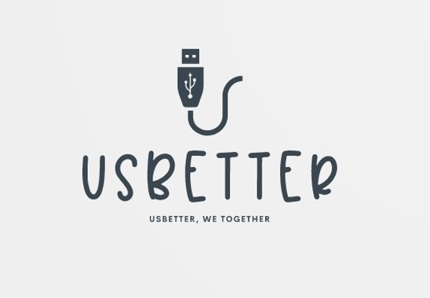
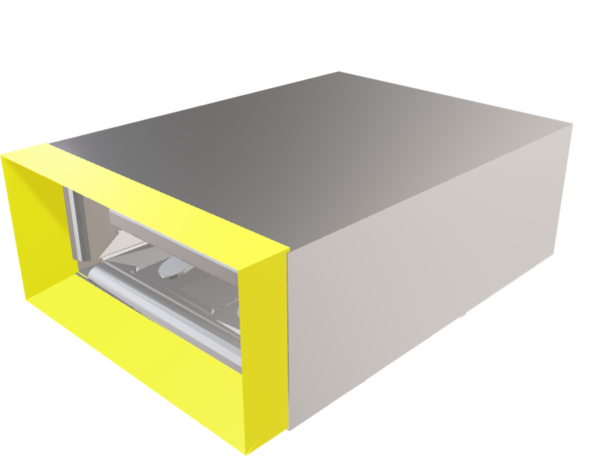
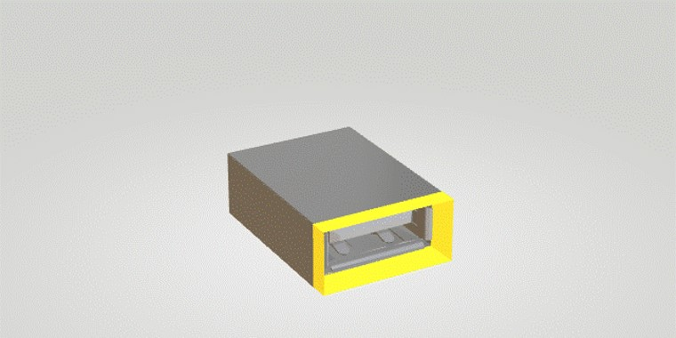

# USBetter





Het gele stukje is de USBetter. 


## USBetter, We Together

### We kennen het allemaal, je wilt een USB-stick in je laptop doen, maar het lukt niet. Dan als we hem er andersom in willen doen, lukt het ook niet. Dan nog een keer andersom, en eidelijk lukt het. Het zijn een paar seconden frustratie, die we hebben opgelost. Met de USBetter kan je de USB-stick in 1 keer in de laptop doen. Zeg gedag tegen die frustratie!


### Wat is de USBetter?

De USBetter is de oplossing voor dit probleem. Het is een klein stukje plastic (14 mm x 6,5 mm),  dat precies in en rond je type-A USB-poort (12 mm x 4,5 mm) past. Het is iets heel klein, dus je kan het overal mee naartoe meenemen. Je klikt het in je USB-poort, en dan kan je jouw USB-poort makkelijk gebruiken. Het gaat zo makkelijk, doordat de USBetter in een soort trechtervorm zit. 


### Hoe is de USBetter bedacht?

We keken eerst naar problemen die iedereen wel eens mee maakt, waarbij dit probleem al snel opviel, omdat het voor een klein beetje frustratie zorgt, en omdat iedereen het probleem wel eens heeft. Het idee van een trechter leek al snel een goede oplossing van dit probleem, dus gingen we bezig met een 3D-model maken. Toen we wisten dat we het konden 3D-printen, wisten we dat het zo zou worden gemaakt. 


### Hoe wordt de USBetter gemaakt? 
Zoals al eerder werd gezegd, wordt het ge-3D-print. Dit leek ook een van de weinige manieren om het te maken, want het materiaal moest een soort van plastic zijn en het moest heel klein zijn. Zo precies werkt alleen een 3D-printer, zeker als we het ook goedkoop willen houden. 


### Hoe willen we de USBetter verkopen? 

De USBetter is heel goedkoop. Dat is zo omdat het met hele nieuwe technologieën wordt gemaakt, het zou een paar centen zijn. Omdat de USBetter heel klein en goedkoop is, zullen we dit product verkopen aan andere bedrijven, die bij hun product, de UsBetter met hun logo kan geven. We verkopen de USBetter die dan met duizenden naar bedrijven die hun eigen touch eraan kunnen geven. 


 


You can use the [editor on GitHub](https://github.com/Meridiaan-College/UsBetter/edit/gh-pages/index.md) to maintain and preview the content for your website in Markdown files.

Whenever you commit to this repository, GitHub Pages will run [Jekyll](https://jekyllrb.com/) to rebuild the pages in your site, from the content in your Markdown files.

### Markdown

Markdown is a lightweight and easy-to-use syntax for styling your writing. It includes conventions for

```markdown
Syntax highlighted code block

# Header 1
## Header 2
### Header 3

- Bulleted
- List

1. Numbered
2. List

**Bold** and _Italic_ and `Code` text

[Link](url) and 
```

For more details see [GitHub Flavored Markdown](https://guides.github.com/features/mastering-markdown/).

### Jekyll Themes

Your Pages site will use the layout and styles from the Jekyll theme you have selected in your [repository settings](https://github.com/Meridiaan-College/UsBetter/settings/pages). The name of this theme is saved in the Jekyll `_config.yml` configuration file.

### Support or Contact

Having trouble with Pages? Check out our [documentation](https://docs.github.com/categories/github-pages-basics/) or [contact support](https://support.github.com/contact) and we’ll help you sort it out.
