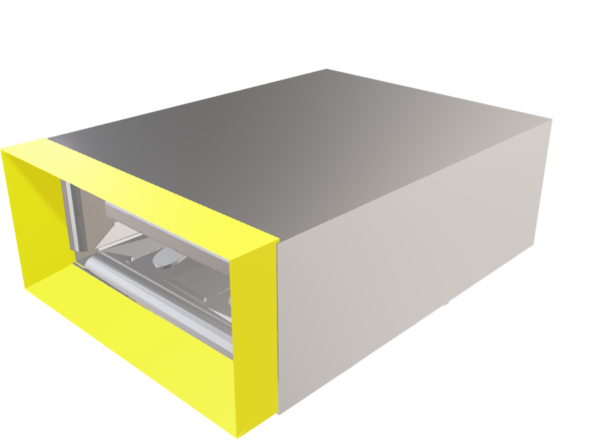

## Welcome to GitHub Pages


# UsBetter



## Usbetter, We Together


We kennen het allemaal, dat we een USB-stick in onze laptop en het lukt niet. Dan als we hem er andersom in willen doen, lukt het ook niet. Dan nog een keer andersom, maar eidelijk lukt het. Het zijn een paar seconden frustratie, die we hebben opgelost. Met de UsBetter kan je de USB-stick in 1 keer in de laptop doen. 

### Wat is de UsBetter?

De UsBetter is een klein stukje plastic, met een beetje de vorm van een trechter. Het zorgt ervoor dat de UsB-stick soepel in de poort gaat. 

You can use the [editor on GitHub](https://github.com/Meridiaan-College/UsBetter/edit/gh-pages/index.md) to maintain and preview the content for your website in Markdown files.

Whenever you commit to this repository, GitHub Pages will run [Jekyll](https://jekyllrb.com/) to rebuild the pages in your site, from the content in your Markdown files.

### Markdown

Markdown is a lightweight and easy-to-use syntax for styling your writing. It includes conventions for

```markdown
Syntax highlighted code block

# Header 1
## Header 2
### Header 3

- Bulleted
- List

1. Numbered
2. List

**Bold** and _Italic_ and `Code` text

[Link](url) and 
```

For more details see [GitHub Flavored Markdown](https://guides.github.com/features/mastering-markdown/).

### Jekyll Themes

Your Pages site will use the layout and styles from the Jekyll theme you have selected in your [repository settings](https://github.com/Meridiaan-College/UsBetter/settings/pages). The name of this theme is saved in the Jekyll `_config.yml` configuration file.

### Support or Contact

Having trouble with Pages? Check out our [documentation](https://docs.github.com/categories/github-pages-basics/) or [contact support](https://support.github.com/contact) and we’ll help you sort it out.
